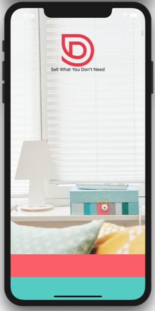
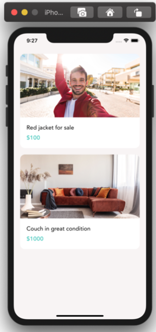
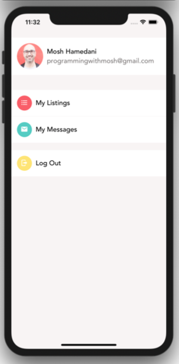
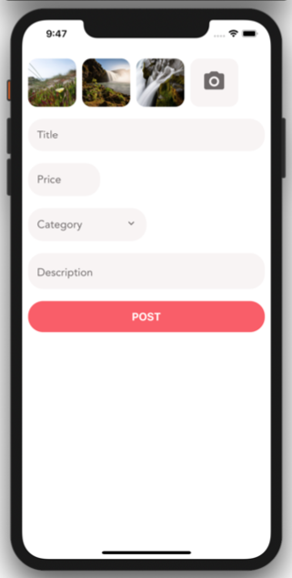

# Opdracht: Styling

## Assets
De assets kan je [hier](assets/assets.zip) downloaden.

## Opzet

* Maak een nieuw React Native project (met Expo). 
* Gebruik volgende kleuren: `#fc5c65`,  `#4ECDC4`, `#ffe66d`
* Kies een font van Google Fonts en gebruik dit

## Schermen

Maak volgende schermen na. Zorg dat ze aan elkaar gelinkt zijn via een navigatie (tabs, deze staan niet op de screenshots)
De assets kan je hierboven downloaden.

Probeer zoveel mogelijk gebruik te maken van componenten.

### WelcomeScreen

De onderste knoppen zijn een Login en Register knop, geef deze ook tekst.

### ListingScreen

Zorg voor een knop in dit scherm (je kiest zelf waar).
Bij het klikken op deze knop open je de `AddListingScreen`.

### AccountScreen

### AddListingScreen

Na het klikken op de knop in het formulier sluit je dit scherm terug

## Advanced
We bouwen een simpele authenticatie.

Toon eerst het WelcomeScreen.
Na klikken op de Login knop:
- Sla je dit op ahv `useContext`
- Toon je (op basis van de context) het scherm met de tabs

Na klikken op Logout (in AccountScreen):
- Sla je dit op ahv `useContext`
- Toon je (op basis van de context) het WelcomeScreen

## Super advanced
- Hou de status (ingelogd / uitgelogd) bij via `AsyncStorage`
- Maak een LoginScherm waarbij je inlogt met een username. Deze toon je eenmaal ingelogd in de AccountScreen