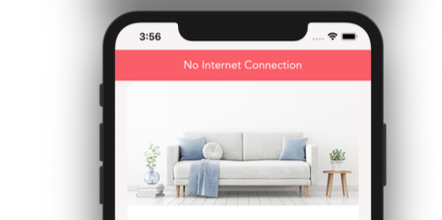

# Opdracht: Network

Voeg aan `ListingScreen` een banner toe die aangeeft dat er geen internet connectie is.
Zorg voor een design component en een "slimme" component.

Maak gebruik van de Expo API's.

